## Problem

While CloudBerry Backup is great for day-to-day use, the initial  backup may pose a problem for users with slow or pricey internet connection. Suppose you installed Cloudberry Backup on your computer and want to start backing up one of your hard drives. If the volume of the data is relatively small, the task is pretty much straightforward: set up a backup plan and run it. However, if you’re working with rather large volumes of data, poor or expensive internet connection may urge you to find a different solution to this problem. Namely, use a different computer that has a decent connection. 

Naturally, CloudBerry Backup stores files in a certain way: certain file structure, certain file naming conventions, etc. So you cannot just “dump” your files into your cloud storage on one computer, and then expect CloudBerry Backup on another computer to just “pick up” those files during the next backup plan execution.

## Resolution

There is a workaround for this issue, however. You have two options:

<ol>
	<li>Use “Custom Mode” when creating a backup plan. This is the <b>easier option</b>. That way you don’t need to get technical and tinker with buckets, repository syncs, changing prefixes, setting identical file structures on both computers, etc. Note that this option is fairly unsophisticated and does not allow you to use encryption. In summary, <b>little effort and few options</b>. </li>  
	<li>Use “Advanced Mode” when creating a backup plan. This option gives you <b>greater flexibility</b> when it comes to backup options, while requiring extra effort in setting things up properly on both machines. In summary, <b>extra effort and extra options</b>.</li>
</ol>

This article is only <b>covering the second option</b>. To learn more about the first option – read [this](http://kb.cloudberrylab.com/kb1052/) article.

Without further ado, let’s get to the tutorial.

Let's talk about the "Advanced Mode" in detail. The main idea here is to ensure that both computers have <b>identical settings</b>. Namely, backup prefix, file structure, and cloud storage credentials.

 First, ensure that file structure is the same on both machines. For instance, if the folder "Docs" is located at C:/Docs on the "slow PC", ensure that it is also located at C:/Docs on the "fast PC", so that both computers will upload into the same cloud folder.

Second, ensure that you have the same cloud credentials (security keys and the bucket) in the <b>Account Settings</b>.

Third, ensure that you have the same backup prefix on both machines by going to <b>Edit Accounts</b>.

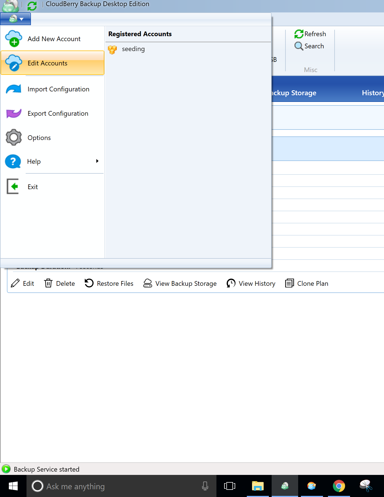    

 Select your account and click <b>Edit</b>. 

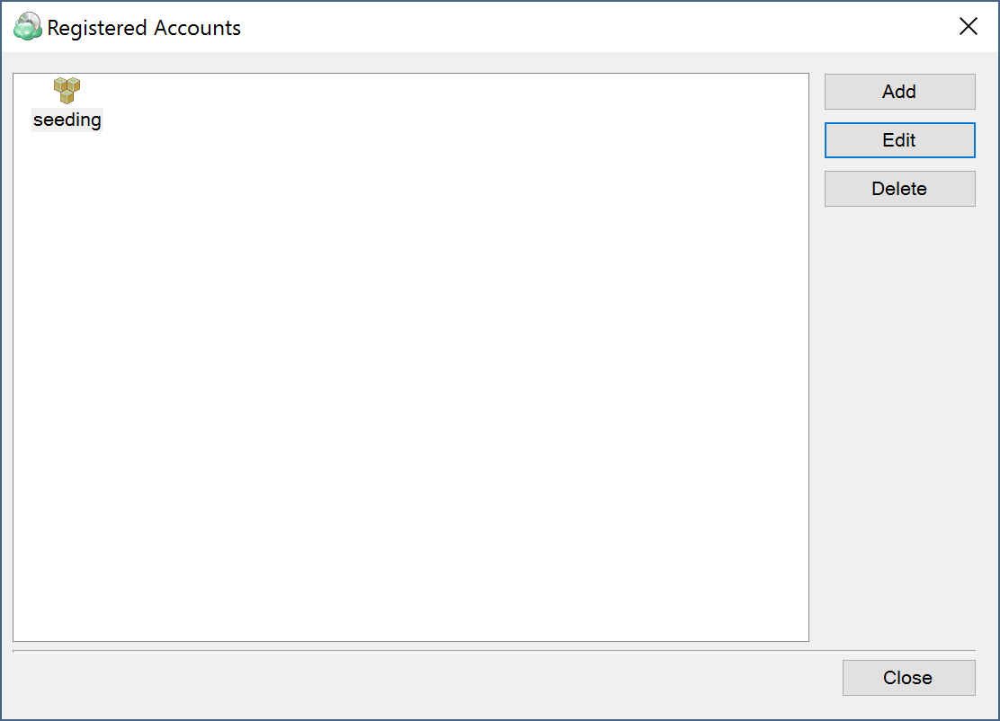    

 Then click "Advanced settings". 

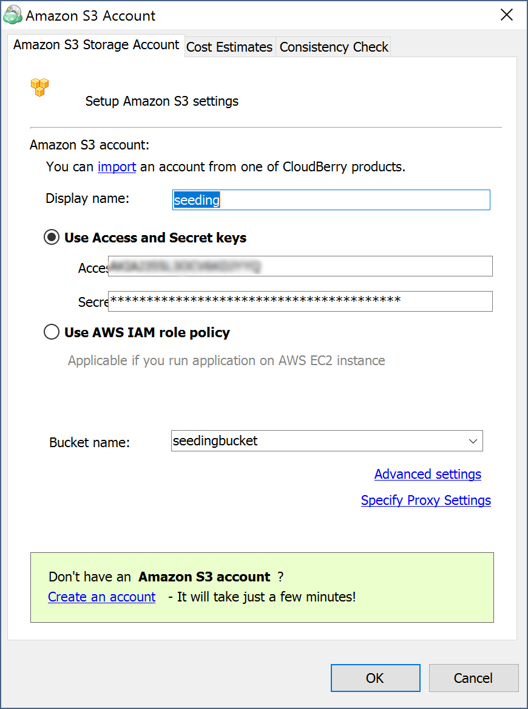    

Enter any prefix you want, just keep in mind that you have to enter the same prefix on both machines to have smooth and successful backups. 

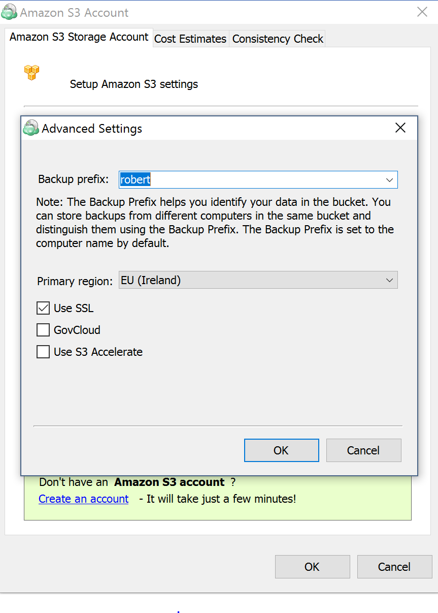    

Now you need to copy your large files onto an external hard drive. In our example a folder named “Docs” was copied from the “slow PC” onto a USB flash drive. This folder contains all the large files that would take forever to upload on the “slow PC“. 

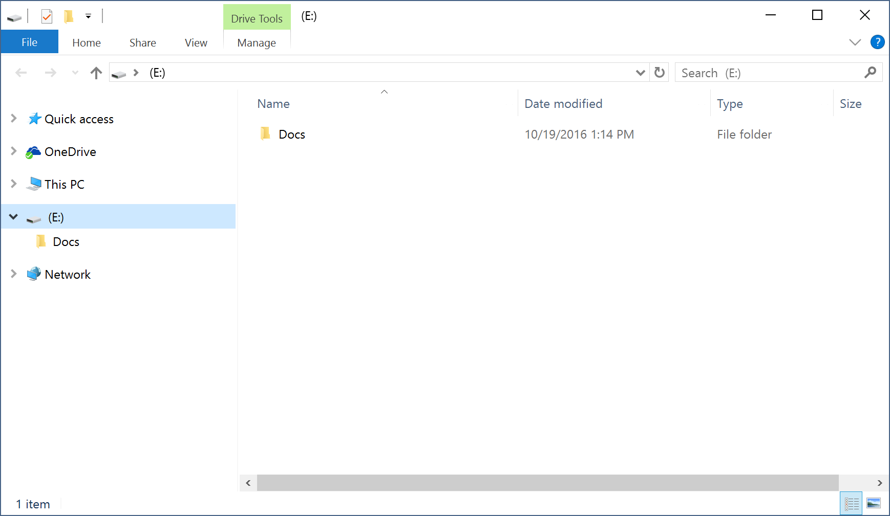    

Now open CloudBerry Backup on the “fast PC” and enter your Amazon credentials (security keys). Then create a backup plan as follows:

<ol>
	<li>Launch the Backup Wizard and click <b>Next</b>.</li>  
	<li>Select your storage and click <b>Next</b>.</li>  
	<li>Pick a name for your backup plan and click <b>Next</b>.</li>  
	<li>Select Advanced Mode”. Click <b>Next</b>.</li>  
  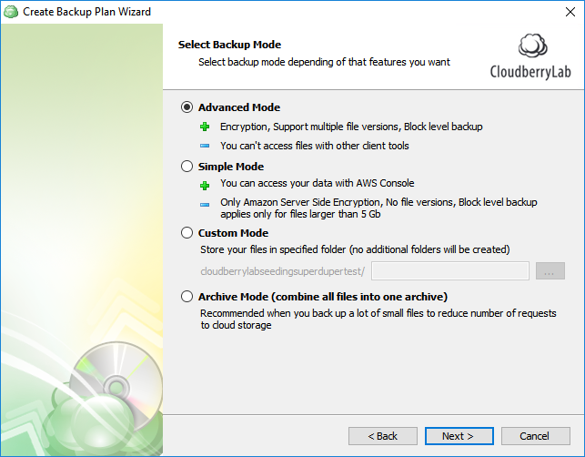    
	<li>Specify the folder you wish to upload. Click <b>Next</b>.</li>  
      
	<li>Enable compression or encryption if needed. Click <b>Next</b>.</li>  

  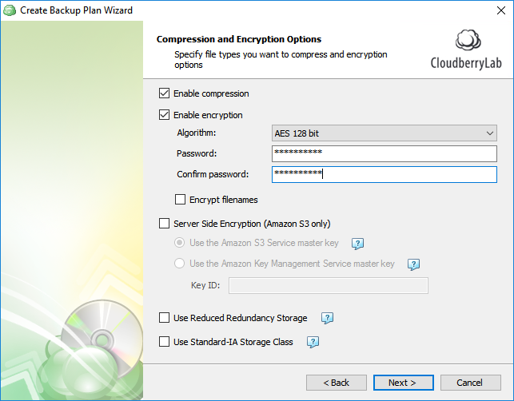    
	<li>Continue setting up the plan. Upon finishing, select the "Run now" checkbox and then wait intil the backup plan execution completes. Your data should now be successfully uploaded into the specified folder in the cloud storage.</li> 

  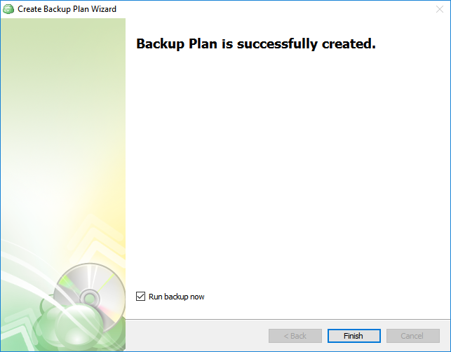    
    
</ol>

Notice that we only have 5 files in the “Doсs” folder. Now let’s get back to that very folder on the “Slow PC”, add a file to it and do the same process again. As you see on the screenshot below, 2 files were added (their names start with "NEW").

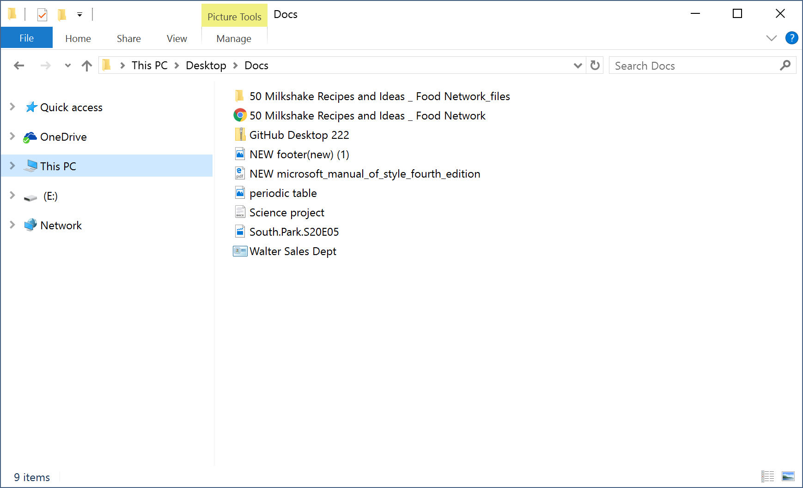  

Launch CloudBerry Backup on the “slow PC” and create the exact same backup plan as you did on the “fast PC”. If you have enabled encryption – make sure that you use the same encryption type and the same passcode. Before you run the plan, ensure that all repositories are synced to avoid reuploading large files. To do so, go to <b>Cloudberry Options</b>. 

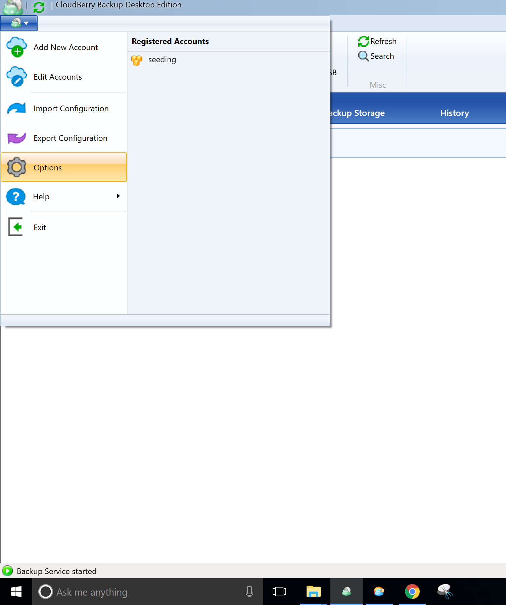  

Under <b>Repository</b>, click <b>Synchronize Repository</b>, and then click <b>Synchronize Now</b>. 

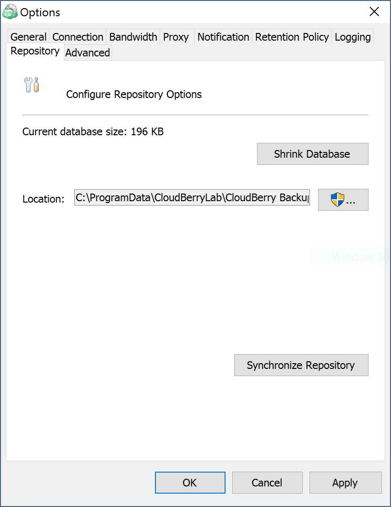    

Then close the pop-up window and run the backup plan. All added files should appear in your cloud storage.

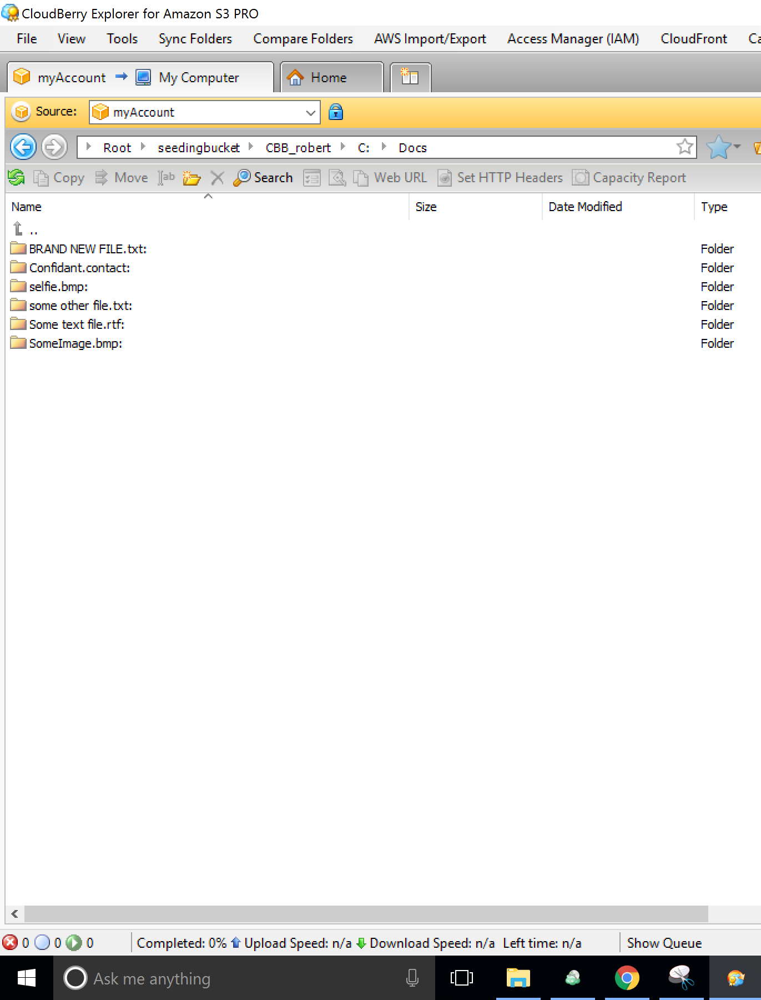    

Likewise, whenever you modify any files within that folder, just run the backup plan and you’re good to go.

If you still have any questions regarding seeding data -- be it general inquiries, licensing, sign-up, or any other issues -- feel free to drop us a line at <a href="mailto:support@cloudberrylab.com">support@cloudberrylab.com</a>, and we will get back to you shortly.

